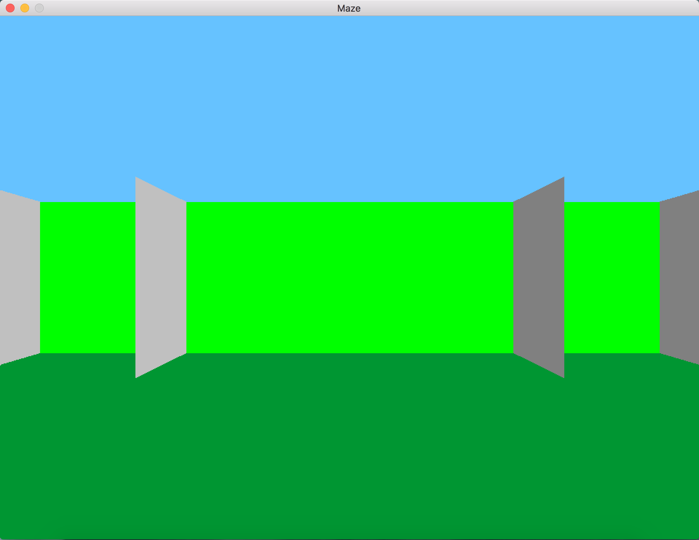

# Maze

This project is a first person 3D game inspired by Wolfenstein3d, where the player has to find a way out of a maze. 
The game uses ray casting technique to create the apparent 3D nature of the maze.


* Author: ```Siphan Bou```
* Date: ```October 29, 2017```
* Language: ```C```
* Compiler: ```gcc```
* Library: ```SDL2```
* Runs on ```Mac OS X``` and ```Linux```


## Directory structure:
* ```src```: source files
* ```inc```: header files
* ```imgs```: image files

--------------------------------------------------------


## How to start

To launch the game:

* Install SDL2
	* [On Mac OS](http://lazyfoo.net/tutorials/SDL/01_hello_SDL/mac/index.php)
	* [On Linux](http://lazyfoo.net/tutorials/SDL/01_hello_SDL/linux/index.php)

* Clone, compile, and run the program via the command line:
```
git clone https://github.com/Siphan/holbertonschool-low_level_programming.git
cd holbertonschool-low_level_programming/maze/
make
./maze
```

Alternatively, if you're not using `make`, you can type the following command to compile:
```
gcc src/*c -Wall -Werror -Wextra -pedantic -I./inc -lSDL2 -o maze `sdl2-config --libs` -lSDL2_ttf
```

A window will pop up with the game, like thus:



* North facing walls are gray
* South facing walls are silver
* West facing walls are blue
* East facing walls are red

----------------------------------------------------------------------------------------------------------------
## How to play

* You can rotate the camera with the `left` and `right` arrow keys.

* You can move the player by pressing the `w`, `a`, `s`, and `d` keys.
	* `w` to move forward
	* `a` to move left
	* `s` to move right
	* `d` to move back

* You can quit the game in 3 manners:
	* By pressing the `esc` key
	* By x-ing out the window
	* By pressing `ctrl` + `c` in the command line 
